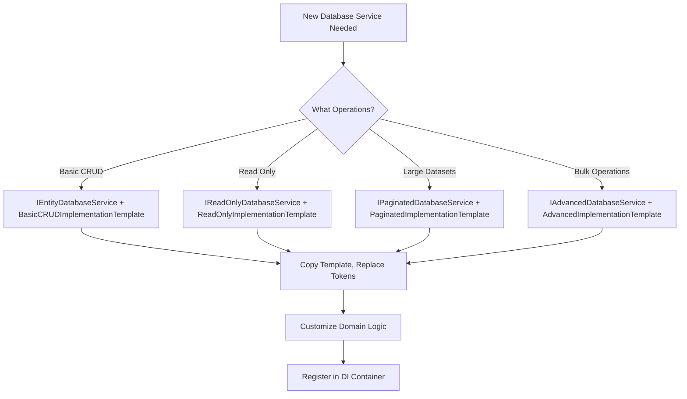

# AI-Optimized Development Guide for Centro

## Overview

This guide establishes **AI-first development principles** for Centro that optimize for artificial intelligence agent maintenance, debugging, and extension rather than human cognitive patterns. This comprehensive guide covers code organization, quality standards, and TDD processes specifically designed for AI development workflows.

**Core Philosophy**: Maximize **context density**, **logical cohesion**, and **quality feedback loops** to enable AI agents to understand, maintain, and extend code with minimal file reads and maximum contextual understanding.

## Part 1: AI vs Human Development Differences

### Human Developer Constraints

- **Limited working memory** - prefer smaller, focused files
- **Sequential reading** - one file at a time processing
- **Cognitive overload** - too much information reduces comprehension
- **Separation of concerns** - clear boundaries reduce mental complexity

### AI Agent Advantages

- **Unlimited context window** - can process large amounts of code simultaneously
- **Pattern recognition** - excels at seeing relationships across entire codebases
- **Context switching cost** - file boundaries create artificial barriers
- **Comprehensive analysis** - benefits from seeing complete implementation patterns
- **Static analysis integration** - can process analyzer feedback immediately

## Part 2: AI-Optimized Code Organization

### 1. Context Density Maximization

**Principle**: Group logically cohesive components in single files to maximize context availability.

**Traditional Approach (Human-Optimized)**:

```
src/Centro.Providers/Wise/
├── Models/
│   ├── WiseBalanceResponse.cs     # 20 lines
│   ├── WiseAmount.cs              # 5 lines  
│   └── WiseErrorResponse.cs       # 15 lines
├── Exceptions/
│   ├── WiseProviderException.cs   # 25 lines
│   └── WiseAuthenticationException.cs # 15 lines
├── WiseApiClient.cs               # 80 lines
├── WiseBalanceAdapter.cs          # 100 lines
└── WiseServiceExtensions.cs       # 30 lines
```

**Total**: 8 files, ~290 lines distributed

**AI-Optimized Approach**:

```
src/Centro.Providers/
└── WiseBalanceProvider.cs         # 290 lines, complete context
```

**Benefits**:

- ✅ **Single read operation** provides complete provider understanding
- ✅ **Immediate dependency visibility** - no hidden imports or references
- ✅ **Complete error landscape** - all exception types visible when reading business logic
- ✅ **Change impact analysis** - modifications show full ripple effects
- ✅ **Pattern completeness** - entire implementation pattern visible at once

### 2. Top-to-Bottom Dependency Flow

**Principle**: Organize code within files to follow natural dependency flow from primitives to complex logic.

**File Organization Pattern**:

```csharp
// 1. API Models (primitives, no dependencies)
public record WiseBalanceResponse(...);
public record WiseAmount(...);

// 2. Domain Exceptions (depend on models for context)
public class WiseProviderException : Exception { ... }
public class WiseAuthenticationException : WiseProviderException { ... }

// 3. Infrastructure Components (depend on models + exceptions)
internal class WiseApiClient 
{
    // Uses WiseBalanceResponse, throws WiseProviderException
}

// 4. Business Logic (depends on all above)
public class WiseBalanceAdapter : IBalanceService
{
    // Uses WiseApiClient, maps WiseBalanceResponse, handles exceptions
}

// 5. Configuration (depends on business logic for registration)
public static class WiseServiceExtensions
{
    public static IServiceCollection AddWiseBalanceProvider(...)
}
```

### 3. File Size Guidelines

**AI-Optimized Files**:

- **Target**: 200-500 lines for complete feature implementation
- **Maximum**: 800 lines before considering logical split
- **Minimum**: No artificial minimums - completeness over size

**Splitting Criteria**:

- **Logical boundary violation** - mixing unrelated concerns
- **Multiple provider implementations** - each provider gets own file
- **Genuine reusability** - component used across multiple features

## Part 3: Code Quality for AI Development

### Pre-Development Analysis (MANDATORY)

**BEFORE writing any code, run these commands to understand current quality state:**

```bash
# 1. Full build with analyzer feedback
dotnet build --verbosity normal

# 2. Count current warnings by type
dotnet build --no-restore 2>&1 | grep "warning" | cut -d: -f4 | sort | uniq -c | sort -nr

# 3. Check for security-specific warnings
dotnet build --no-restore 2>&1 | grep -E "CA3[0-9]{3}|S2068|S4423"

# 4. Auto-fix formatting (safe operation)
dotnet format whitespace

# 5. Verify tests still pass after formatting
dotnet test --no-build
```

### Available Static Analysis Tools

- **StyleCop.Analyzers**: Code style and consistency (SA#### rules)
- **Microsoft.CodeAnalysis.NetAnalyzers**: Security and reliability (CA#### rules)  
- **SonarAnalyzer.CSharp**: Code smells and maintainability (S#### rules)

### Security Rules (Zero Tolerance)

- **CA3001**: SQL injection vulnerabilities
- **CA3002**: XSS vulnerabilities  
- **CA3003**: File path injection vulnerabilities
- **CA3004**: Information disclosure vulnerabilities
- **CA3012**: Regex injection vulnerabilities
- **S2068**: Hardcoded credentials/passwords/API keys
- **S4423**: Weak SSL/TLS protocols
- **S5122**: Insecure CORS configuration

### Reliability Rules (High Priority)

- **CA2007**: ConfigureAwait(false) - disabled for ASP.NET Core
- **CA2201**: Reserved exception types
- **CA2208**: ArgumentException instantiation
- **S112**: Generic exceptions should not be thrown
- **S1481**: Unused local variables
- **S1854**: Unused assignments

### Maintainability Rules (Medium Priority)

- **SA1518**: File should end with newline
- **SA1028**: No trailing whitespace
- **SA1516**: Elements separated by blank lines
- **SA1413**: Trailing commas in multi-line initializers
- **S138**: Functions should not have too many lines
- **S1541**: Methods should not be too complex

### AI Development Workflow for Code Quality

#### Step 1: Pre-Code Analysis

```bash
# Get baseline quality metrics
echo "=== Current Quality State ==="
dotnet build --no-restore 2>&1 | grep -c "warning"
echo "Total warnings before changes"

# Show security warnings specifically
echo "=== Security Issues ==="
dotnet build --no-restore 2>&1 | grep -E "CA3[0-9]{3}|S2068|S4423"
```

#### Step 2: During Development

- **Fix warnings in files you modify** - don't ignore analyzer feedback
- **Use `dotnet format whitespace` frequently** - auto-fixes many style issues
- **Pay attention to security warnings** - financial systems require zero tolerance
- **Test after each change** - `dotnet test --no-build`

#### Step 3: Pre-Commit Validation

```bash
# Final quality check
echo "=== Final Quality Check ==="
dotnet build --verbosity normal

# Count remaining warnings
dotnet build --no-restore 2>&1 | grep -c "warning"
echo "Total warnings after changes (should be same or fewer)"

# Ensure no new security issues
dotnet build --no-restore 2>&1 | grep -E "CA3[0-9]{3}|S2068|S4423" && echo "SECURITY ISSUES FOUND!" || echo "No security issues detected"

# Format and test
dotnet format whitespace --verify-no-changes
dotnet test --no-build
```

### Financial Code Standards

#### Currency and Precision

- Use `decimal` for all financial calculations
- Specify culture for string formatting: `ToString("C", CultureInfo.InvariantCulture)`
- Validate currency codes against ISO 4217

#### API Security

- Always validate tenant isolation via `X-Tenant-ID`
- Log all financial operations with correlation IDs
- Sanitize all inputs from external provider APIs
- Use structured logging for audit trails

#### Error Handling

- No silent failures in financial operations
- Include correlation IDs in error responses
- Log errors at appropriate levels (Warning for business logic, Error for system failures)
- Return meaningful error codes to clients

### Quality Gates for Centro

1. **Zero security warnings** (CA3xxx, S2068, S4423, S5122)
2. **Fix style warnings in modified files** (SA1xxx)
3. **No unused code in new implementations** (S1481, S1854)
4. **All tests pass** after quality fixes
5. **Files end with newlines** (SA1518)
6. **No trailing whitespace** (SA1028)

---

## Part 4: Test-Driven Development (TDD) for AI Agents

### TDD Philosophy for AI Development

**Core Principle**: Test-Driven Development ensures reliable functionality while preventing common AI development anti-patterns like logic smuggling and test gaming.

**AI-Specific TDD Benefits**:
- **Prevents logic smuggling** - implementing features without corresponding tests
- **Prevents test gaming** - hardcoded returns that satisfy tests without real logic
- **Ensures comprehensive coverage** - every requirement has explicit test validation
- **Enables confident refactoring** - AI agents can safely improve code structure

### TDD Process Overview

**The Three-Phase Cycle**:
1. **RED**: Write one failing test for one behavior
2. **GREEN**: Implement complete behavior to make the test pass
3. **REFACTOR**: Improve code quality without changing functionality

**Critical Distinction**: "One test" means **one behavior**, not **one assertion**. Multiple assertions are often required to fully specify a behavior and prevent gaming.

### Phase 1: RED - Writing Failing Tests

#### What "One Test" Really Means

**❌ WRONG - Single Assertion (Encourages Gaming)**:
```csharp
[Test]
public void ValidateSortCode_ValidInput_ReturnsTrue()
{
    Assert.IsTrue(mapper.ValidateSortCode("12-34-56")); // Can be satisfied with: return true;
}
```

**✅ CORRECT - One Behavior, Multiple Assertions (Prevents Gaming)**:
```csharp
[Test]
public void ValidateSortCode_ShouldValidateFormatCorrectly()
{
    // Valid cases (cannot hardcode true)
    Assert.IsTrue(mapper.ValidateSortCode("12-34-56"));
    Assert.IsTrue(mapper.ValidateSortCode("99-88-77"));
    
    // Invalid cases (cannot hardcode false)
    Assert.IsFalse(mapper.ValidateSortCode("invalid"));
    Assert.IsFalse(mapper.ValidateSortCode("12-34-567"));
    Assert.IsFalse(mapper.ValidateSortCode("ab-cd-ef"));
    
    // Mixed results force real validation logic implementation
}
```

#### Anti-Gaming Test Patterns

**Pattern 1: Mixed Valid/Invalid Cases**
```csharp
[Test]
public void ProcessPayment_ShouldHandleVariousScenarios()
{
    // Success cases
    Assert.IsTrue(processor.ProcessPayment(validPayment1));
    Assert.IsTrue(processor.ProcessPayment(validPayment2));
    
    // Failure cases  
    Assert.IsFalse(processor.ProcessPayment(invalidPayment1));
    Assert.IsFalse(processor.ProcessPayment(invalidPayment2));
    
    // Cannot satisfy with hardcoded return values
}
```

**Pattern 2: Boundary Value Testing**
```csharp
[Test]
public void ValidateAmount_ShouldEnforceLimits()
{
    // Below minimum
    Assert.IsFalse(validator.ValidateAmount(0.00m));
    
    // At minimum boundary
    Assert.IsTrue(validator.ValidateAmount(0.01m));
    
    // Normal range
    Assert.IsTrue(validator.ValidateAmount(100.00m));
    
    // At maximum boundary  
    Assert.IsTrue(validator.ValidateAmount(10000.00m));
    
    // Above maximum
    Assert.IsFalse(validator.ValidateAmount(10000.01m));
}
```

**Pattern 3: Data Transformation Verification**
```csharp
[Test]
public void MapAccount_ShouldTransformCorrectly()
{
    var input = new BankAccount { SortCode = "12-34-56", AccountNumber = "12345678" };
    var result = mapper.MapAccount(input);
    
    // Verify specific transformations (cannot be hardcoded)
    Assert.AreEqual("123456", result.SwiftCode);
    Assert.AreEqual("GB29NWBK12345678", result.IBAN);
    Assert.AreEqual("ACTIVE", result.Status);
}
```

#### Requirement Analysis Before Testing

**MANDATORY**: Before writing any test, analyze the ticket for ALL testable requirements:

```bash
# Use this mental checklist for every requirement:
# 1. What inputs are valid/invalid?
# 2. What transformations should occur?
# 3. What error conditions must be handled?
# 4. What edge cases exist?
# 5. What validations are required?
```

**Example Requirement Analysis**:
```
Ticket: "Implement sort code validation for GB FPS payments"

Testable Requirements:
✅ Validates format XX-XX-XX (6 digits with hyphens)
✅ Rejects invalid formats (wrong length, missing hyphens, non-numeric)
✅ Handles null/empty inputs gracefully
✅ Maps valid sort codes to SWIFT codes
✅ Returns appropriate error messages for failures
```

### Phase 2: GREEN - Implementing Complete Behavior

#### The "Complete Behavior" Principle

**❌ WRONG - Minimal Code (Traditional TDD)**:
```csharp
public bool ValidateSortCode(string code)
{
    return true; // "Minimal" implementation that games the test
}
```

**✅ CORRECT - Complete Behavior Implementation**:
```csharp  
public bool ValidateSortCode(string code)
{
    if (string.IsNullOrWhiteSpace(code))
        return false;
        
    // Complete regex validation for XX-XX-XX format
    var sortCodePattern = @"^\d{2}-\d{2}-\d{2}$";
    return Regex.IsMatch(code, sortCodePattern);
    
    // Implements complete behavior for sort code validation
    // Cannot be gamed - handles all test scenarios properly
}
```

#### Implementation Quality Gates

During GREEN phase, implementation must:

1. **Handle ALL test scenarios** - not just the happy path
2. **Use real logic** - no hardcoded returns or obvious stubs
3. **Be production-ready** - complete implementation for this specific behavior
4. **Stay focused** - only implement behavior covered by current test
5. **Pass security analysis** - no CA3xxx, S2068, S4423 warnings

#### Logic Smuggling Prevention

**Definition**: Logic smuggling occurs when you implement requirements without corresponding tests.

**Prevention Strategies**:
```bash
# 1. Requirement-to-test mapping
# Every ticket requirement must have explicit test coverage

# 2. Implementation tracking  
git add -A && git stash push -m "TDD-cycle-baseline"
# After implementation: check for unexpected changes
git diff stash@{0} -- src/ | grep -v tests/

# 3. Test isolation
# Run only current test to verify GREEN state
dotnet test --filter "FullyQualifiedName~CurrentTestMethod"
```

### Phase 3: REFACTOR - Quality Improvements

**Safe Refactoring Rules**:
- ✅ Improve code structure without changing functionality
- ✅ Apply static analyzer suggestions (style, maintainability)
- ✅ Optimize performance within current behavior scope
- ❌ Do NOT add new functionality or behaviors
- ❌ Do NOT modify test expectations

**Refactoring Examples**:
```csharp
// Before refactor (works but verbose)
public bool ValidateSortCode(string code)
{
    if (string.IsNullOrWhiteSpace(code))
        return false;
    var pattern = @"^\d{2}-\d{2}-\d{2}$";
    var regex = new Regex(pattern);
    return regex.IsMatch(code);
}

// After refactor (improved but same functionality)
public bool ValidateSortCode(string code)
{
    if (string.IsNullOrWhiteSpace(code))
        return false;
        
    return SortCodePattern.IsMatch(code);
}

private static readonly Regex SortCodePattern = new(@"^\d{2}-\d{2}-\d{2}$", RegexOptions.Compiled);
```

### TDD Workflow with Spectrum Tools

**Automated TDD Cycle Management**:
```bash
# Start new TDD cycle
.tools/spectrum-dev tdd-red 'validates sort code format correctly'

# Implement complete behavior (not minimal code)
.tools/spectrum-dev tdd-green

# Optional: improve code quality
.tools/spectrum-dev tdd-refactor

# Commit working cycle
.tools/spectrum-dev tdd-commit 'Implement sort code validation with comprehensive format checking'
```

### Common TDD Anti-Patterns and Solutions

#### Anti-Pattern 1: Test Gaming
**Problem**: `return true;` to make tests pass
**Solution**: Write tests with mixed expected results that require real logic

#### Anti-Pattern 2: Logic Smuggling  
**Problem**: Adding features without corresponding tests
**Solution**: Requirement analysis before implementation, change tracking

#### Anti-Pattern 3: Single Assertion Tests
**Problem**: Tests that can be satisfied with hardcoded values  
**Solution**: Multiple assertions per behavior, boundary testing

#### Anti-Pattern 4: Implementation-First
**Problem**: Writing code then tests (not TDD)
**Solution**: Strict RED → GREEN → REFACTOR discipline

### TDD Quality Metrics

**Success Indicators**:
- ✅ Every requirement has explicit test coverage
- ✅ Tests cannot be satisfied with hardcoded returns
- ✅ Implementation handles all test scenarios correctly
- ✅ No security warnings in TDD cycles (CA3xxx, S2068, S4423)
- ✅ Tests specify complete behavior, not just happy paths

**Failure Indicators**:
- ❌ Tests pass with `return true;` or similar gaming
- ❌ Implementation appears without corresponding tests
- ❌ Single assertion tests that enable hardcoding
- ❌ Requirements implemented across multiple unrelated test cycles

---

## Part 5: Implementation Patterns and Templates

### Using Centro Templates for Consistent Implementation

Centro provides comprehensive templates to ensure consistent implementation patterns across all database services. These templates embed Centro's established practices and reduce implementation variations.

#### Template Discovery

**Location**: `src/Centro.Core/Templates/`

- **Interface Templates** (`DatabaseServiceInterfaces.cs`) - Standardized service contracts
- **Implementation Templates** (`DatabaseImplementationTemplates.cs`) - Complete working examples
- **Documentation** (`README.md`) - Comprehensive usage guide

#### AI-Optimized Template Usage

**Why Templates Matter for AI Development:**

1. **Context Completeness** - Templates show the full implementation pattern in one place
2. **Pattern Recognition** - AI agents can quickly identify and apply established Centro patterns  
3. **Quality Assurance** - Templates embed security, performance, and consistency requirements
4. **Development Speed** - Copy-paste starting point eliminates pattern research time

#### Template Selection Workflow



#### Implementation Pattern Example

**Step 1: Choose Interface Template**
```csharp
// Define service contract using interface template
public interface IBeneficiaryDatabaseService : 
    IEntityDatabaseService<Beneficiary, Guid, BeneficiaryFilter, SaveEntityResponse<Guid>>
{
    // Add domain-specific methods if needed
}
```

**Step 2: Copy Implementation Template**
```csharp
// Copy BasicCRUDImplementationTemplate and replace tokens:
// [Entity] → Beneficiary
// [KeyType] → Guid  
// [Filter] → BeneficiaryFilter
// [SaveResponse] → SaveEntityResponse<Guid>
```

**Step 3: Customize for Domain**
```csharp
public class BeneficiaryDatabaseService : IBeneficiaryDatabaseService
{
    // Template provides Centro patterns:
    // ✅ IDatabaseConnectionStringBuilder + IPostgreSqlIamAuthenticationService
    // ✅ Structured logging with ILogger<T>
    // ✅ PostgreSQL stored function calls  
    // ✅ Tenant isolation (tenantId first parameter)
    // ✅ Proper async/await with cancellation tokens
    // ✅ Error handling for PostgreSQL exceptions
    
    // Customize these areas for your domain:
    CommandText = @"SELECT * FROM get_beneficiary(@p_tenant_id, @p_beneficiary_id)"
    
    var beneficiary = new Beneficiary
    {
        TenantId = reader.GetString("tenant_id"),
        BeneficiaryId = reader.GetGuid("beneficiary_id"),
        FullName = reader.GetString("full_name"), // Domain-specific property
        // ... other domain properties
    };
}
```

#### Template Integration Benefits

**For AI Development:**

1. **Single Context Read** - Complete implementation pattern visible in template
2. **Pattern Consistency** - All database services follow identical structure  
3. **Quality Embedded** - Security, performance, and Centro practices built-in
4. **Change Propagation** - Template updates improve all implementations
5. **Testing Predictability** - Consistent patterns enable shared testing utilities

**Quality Assurance:**

- **Security**: Tenant isolation patterns enforced
- **Performance**: Connection management and caching patterns optimized
- **Maintainability**: Structured logging and error handling standardized
- **Reliability**: Transaction and error recovery patterns proven

#### AI Agent Template Usage

When implementing new database services:

```bash
# 1. Read template documentation
cat src/Centro.Core/Templates/README.md

# 2. Choose appropriate template based on requirements
# 3. Copy implementation template
# 4. Replace placeholder tokens  
# 5. Customize domain-specific logic
# 6. Register service in DI container
```

**Template Documentation Reference:**
- Complete usage examples: `src/Centro.Core/Templates/README.md`
- Interface contracts: `src/Centro.Core/Templates/DatabaseServiceInterfaces.cs`  
- Implementation patterns: `src/Centro.Core/Templates/DatabaseImplementationTemplates.cs`

---